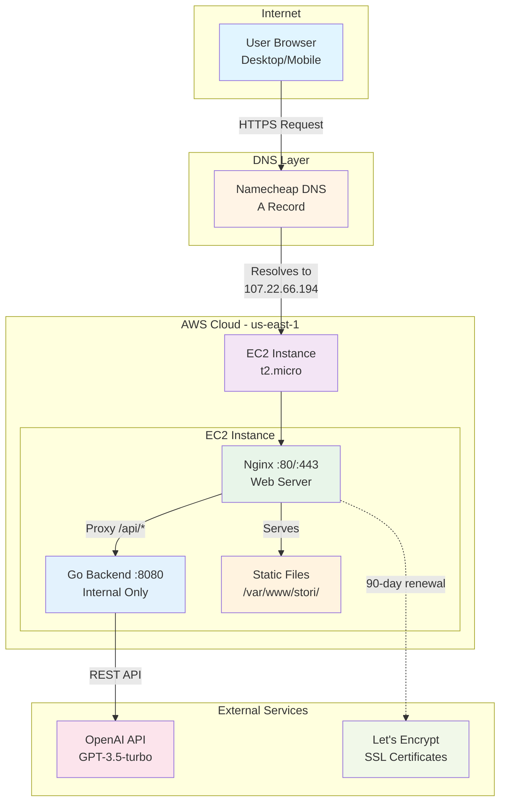
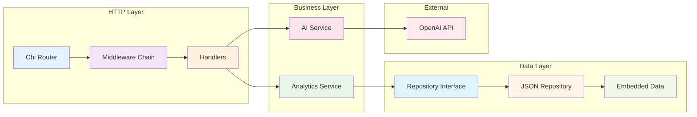
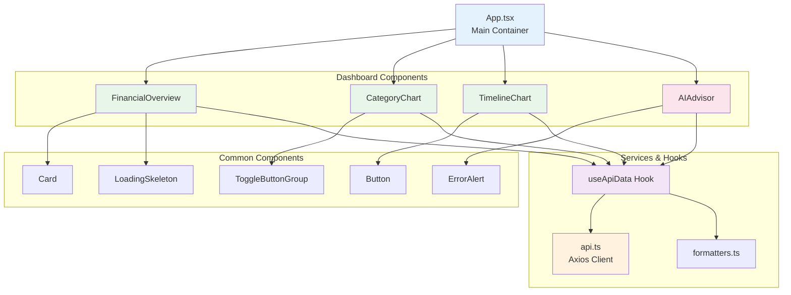
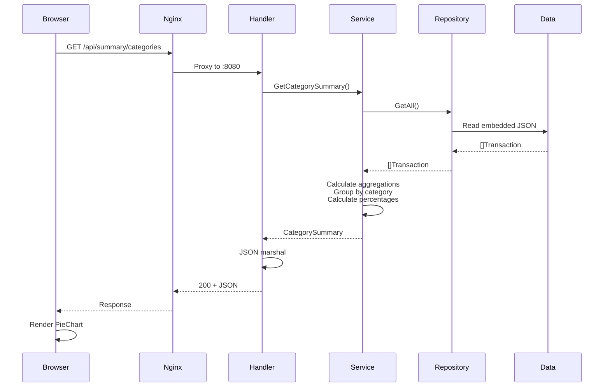
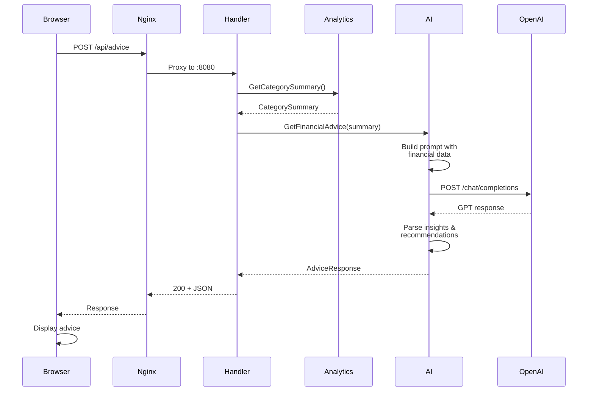
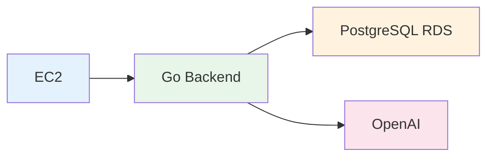
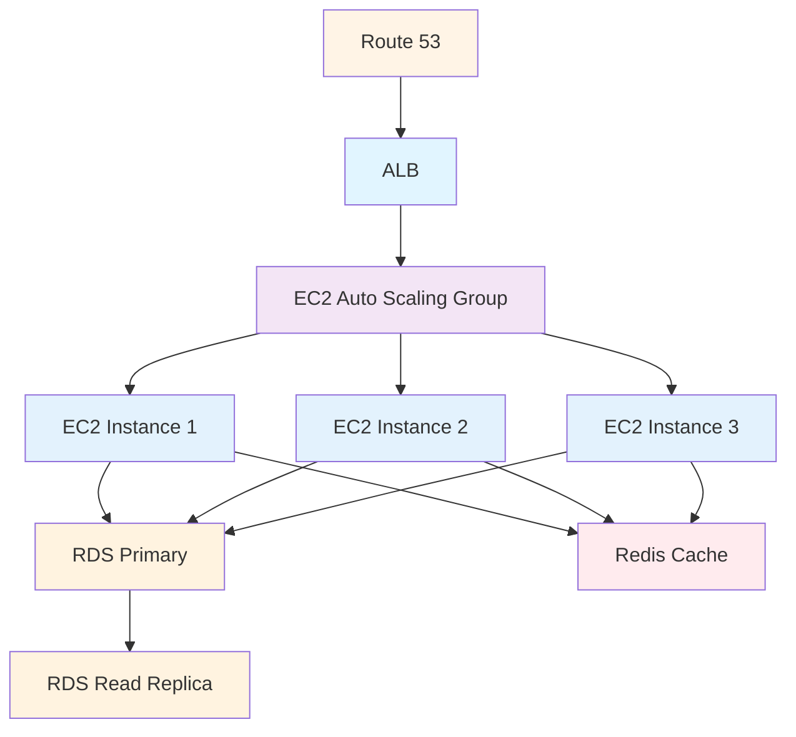
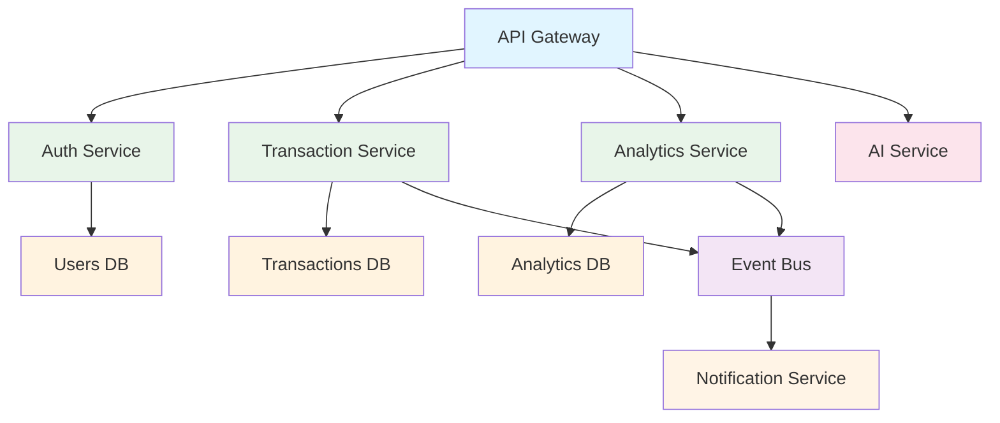
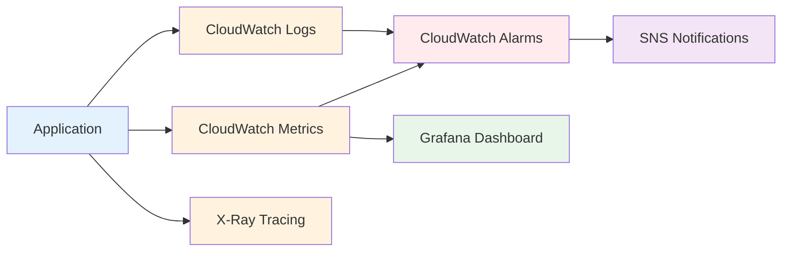

# Architecture Documentation

> System design and technical decisions for Stori Financial Tracker

**Live System:** https://stori.danntastico.dev/

---

## Table of Contents

1. [System Overview](#system-overview)
2. [Component Architecture](#component-architecture)
3. [Data Flow](#data-flow)
4. [Design Decisions](#design-decisions)
5. [Tradeoffs Analysis](#tradeoffs-analysis)
6. [Scalability Path](#scalability-path)

---

## System Overview

### Architecture Philosophy

**Clean Architecture with pragmatic MVP approach:**
- Clear separation of concerns (Domain → Repository → Service → Handler)
- Interface-based abstractions for future extensibility
- Production deployment with development-friendly simplicity
- Security-first design (HTTPS, internal backend, CORS)

### Deployment Architecture



---

## Component Architecture

### Backend Structure



**Layer Responsibilities:**

| Layer | Components | Responsibility |
|-------|-----------|----------------|
| **HTTP** | Chi Router, CORS/Logger/Recovery Middleware, Handlers | Request routing, validation, response formatting |
| **Business** | Analytics Service, AI Service | Business logic, calculations, external integrations |
| **Data** | Repository Interface, JSON Implementation | Data access abstraction, CRUD operations |
| **Domain** | Models, Validation | Core entities, business rules |

### Frontend Architecture



---

## Data Flow

### Request Flow: Category Summary



### Request Flow: AI Advice



---

## Design Decisions

### 1. Repository Pattern

**Decision:** Abstract data access behind interface

```go
type TransactionRepository interface {
    GetAll() ([]Transaction, error)
    GetByDateRange(start, end time.Time) ([]Transaction, error)
}
```

**Rationale:**
- ✅ Easy to swap JSON → PostgreSQL/DynamoDB without touching handlers
- ✅ Testable with mock implementations
- ✅ Clear separation of concerns
- ⚠️ Slight over-engineering for MVP (only JSON implementation exists)

**Future:** Add `PostgresRepository` implementing same interface

---

### 2. Embedded Data vs Database

**Decision:** Use `//go:embed` for JSON data in MVP

**Rationale:**
- ✅ Zero external dependencies for MVP
- ✅ Fast deployment (single binary)
- ✅ No database management overhead
- ✅ Sufficient for read-only demo
- ⚠️ No persistence (can't add/edit transactions)
- ⚠️ Data lives in code (not ideal for production)

**Migration Path:**
```go
// Swap this:
repo := repository.NewJSONRepository(embeddedData)

// To this:
repo := repository.NewPostgresRepository(dbConnection)
```

---

### 3. Nginx Reverse Proxy

**Decision:** Use Nginx in front of Go backend

**Rationale:**
- ✅ SSL termination (Go stays simple HTTP)
- ✅ Static file serving (optimized for performance)
- ✅ Single entry point (one domain, one cert)
- ✅ Backend never exposed directly (security)
- ✅ Easy to add load balancing later
- ⚠️ Additional component to manage

**Alternative Considered:** Direct Go HTTPS server
- Rejected: More complex SSL management, no static file optimization

---

### 4. Single EC2 vs ECS/Lambda

**Decision:** Single EC2 instance for MVP

**Rationale:**
- ✅ Simple deployment (single binary + systemd)
- ✅ Predictable costs (~$8/month)
- ✅ Full control over environment
- ✅ No cold starts (always responsive)
- ⚠️ Single point of failure
- ⚠️ Manual scaling required

**Future:** Migrate to ECS with ALB when traffic justifies complexity

---

### 5. Custom Domain + Let's Encrypt

**Decision:** Purchase `.dev` domain, use Let's Encrypt for SSL

**Rationale:**
- ✅ Professional presentation for interviews
- ✅ Required for mobile HTTPS (browsers block self-signed certs)
- ✅ Free SSL certificates with auto-renewal
- ✅ Portfolio-ready URL
- ⚠️ Domain costs $7/year
- ⚠️ DNS configuration complexity

**Alternative Considered:** Self-signed certificate
- Rejected: Mobile browsers block, unprofessional warnings

---

### 6. OpenAI GPT-3.5 vs GPT-4

**Decision:** Use GPT-3.5-turbo for financial advice

**Rationale:**
- ✅ Cost-effective ($0.50/1M tokens vs $5/1M for GPT-4)
- ✅ Fast response times (~2 seconds)
- ✅ Sufficient quality for financial advice
- ✅ Fallback to mock advice if API fails
- ⚠️ Less sophisticated than GPT-4

**Cost Analysis:** ~$0.02 per advice request with typical prompt size


---

## Tradeoffs Analysis

### Strengths

| Aspect | Benefit |
|--------|---------|
| **Clean Architecture** | Easy to test, extend, and modify individual layers |
| **Repository Pattern** | Data source can be swapped without changing business logic |
| **Production Deployment** | Real HTTPS, custom domain, professional presentation |
| **Type Safety** | TypeScript + Go prevent entire classes of bugs |
| **Monitoring Ready** | Structured logging, health endpoint, systemd integration |
| **Security** | Backend internal, CORS configured, HTTPS enforced |
| **Cost Effective** | ~$15/month total (EC2 + domain + OpenAI usage) |

### Weaknesses

| Aspect | Limitation | Mitigation Plan |
|--------|-----------|----------------|
| **No Persistence** | Can't add/edit data | Add PostgreSQL, implement CRUD handlers |
| **Single Instance** | No high availability | Add ALB + Auto Scaling + multi-AZ |
| **Manual Deployment** | No CI/CD pipeline | Add GitHub Actions workflow |
| **No Authentication** | Anyone can access | Implement JWT auth + user accounts |
| **No Caching** | Every request hits backend | Add Redis for aggregated summaries |
| **Limited Monitoring** | Basic logs only | Add CloudWatch/Prometheus metrics |
| **No Rate Limiting** | OpenAI costs unbounded | Add Redis-based rate limiter |

### Assumptions Made

1. **Read-Only Data:** Challenge focuses on visualization, not CRUD
2. **Single User:** No multi-tenancy or user isolation needed
3. **Low Traffic:** Single EC2 instance sufficient for demo/interview
4. **US-East Region:** All users in similar timezone, no global CDN needed
5. **OpenAI Availability:** Fallback to mock if API fails
6. **Fixed Data:** 10 months of sample data sufficient for demo

---

## Scalability Path

### Phase 1: Current (MVP)
```
1 EC2 → 1 Go Process → Embedded JSON → OpenAI
```
**Handles:** ~100 requests/second, sufficient for demo

---

### Phase 2: Database Migration (Week 1)



**Changes:**
- Add PostgreSQL RDS instance
- Implement `PostgresRepository`
- Add CRUD endpoints
- Database migrations with `golang-migrate`

**Handles:** ~500 requests/second

---

### Phase 3: Horizontal Scaling (Month 1)



**Changes:**
- Application Load Balancer for traffic distribution
- Auto Scaling Group (2-10 instances based on CPU/memory)
- Redis for session storage and cache
- RDS read replica for analytics queries
- CloudFront CDN for frontend

**Handles:** ~10,000 requests/second

---

### Phase 4: Microservices (Month 3-6)



**Changes:**
- Split into independent services
- Service mesh (Istio) for communication
- Separate databases per service
- Event-driven architecture
- Kubernetes (EKS) for orchestration

**Handles:** 100,000+ requests/second, independent scaling

---

### Cost Projection

| Phase | Infrastructure | Monthly Cost |
|-------|---------------|--------------|
| **Phase 1 (Current)** | 1 EC2 t2.micro + domain | ~$15 |
| **Phase 2** | + RDS db.t3.micro | ~$30 |
| **Phase 3** | + ALB + 2-3 EC2 + Redis | ~$150 |
| **Phase 4** | + EKS cluster + microservices | ~$500+ |

---

## Technology Justification

### Backend: Go

**Why Go?**
- Challenge explicitly awards bonus points for Go
- Compiled binary (fast, single-file deployment)
- Excellent concurrency model (goroutines)
- Strong standard library (minimal dependencies)
- Fast compilation and execution
- Type safety without Java verbosity

**Alternatives Considered:**
- Node.js: Rejected (slower, more dependencies, weaker types)
- Python: Rejected (slower execution, not ideal for high-throughput APIs)

---

### Frontend: React + TypeScript + Vite

**Why this stack?**
- React: Industry standard, rich ecosystem, excellent charting libraries
- TypeScript: Type safety catches errors early, self-documenting
- Vite: Fast HMR, optimized builds, modern dev experience
- TailwindCSS: Rapid styling, mobile-first, small bundle size

**Alternatives Considered:**
- Vue/Svelte: Rejected (smaller ecosystem for financial charts)
- Create React App: Rejected (slower, deprecated by React team)

---

### Hosting: AWS EC2

**Why EC2 over alternatives?**

| Option | Pros | Cons | Decision |
|--------|------|------|----------|
| **EC2** | Full control, predictable, simple | Manual scaling | ✅ Chosen |
| **ECS** | Container native, easier scaling | More complex setup | Future phase |
| **Lambda** | Serverless, auto-scaling | Cold starts, limits | Not ideal for persistent API |
| **Heroku** | Simplest deployment | Expensive, less control | Not AWS as required |

---

### Charts: Recharts

**Why Recharts?**
- React-native (no D3 complexity)
- Responsive out of the box
- Good mobile support
- Composable API (easy customization)
- TypeScript definitions included

**Alternatives Considered:**
- Chart.js: Rejected (imperative API, harder React integration)
- D3.js: Rejected (steep learning curve, overkill for simple charts)

---

## Security Considerations

### Current Implementation

| Aspect | Implementation |
|--------|---------------|
| **HTTPS** | Enforced via Let's Encrypt, HTTP redirects to HTTPS |
| **CORS** | Restricted to specific origins (no `*` wildcard) |
| **Backend Exposure** | Internal only (:8080), not publicly accessible |
| **SSL Certificates** | Auto-renewing, trusted CA |
| **API Keys** | Stored in environment variables, never committed |
| **Input Validation** | Date parsing, type checking on all endpoints |

### Production Additions Needed

- **Authentication:** JWT tokens, OAuth 2.0
- **Rate Limiting:** Redis-based, per-user quotas
- **SQL Injection:** Prepared statements (when DB added)
- **XSS Prevention:** Content Security Policy headers
- **DDoS Protection:** AWS Shield, CloudFlare
- **Secrets Management:** AWS Secrets Manager
- **Audit Logging:** CloudWatch Logs with retention

---

## Monitoring & Observability

### Current State

**Logs:**
- Backend: Structured logging to systemd journal
- Nginx: Access and error logs
- Frontend: Browser console errors

**Health Check:**
- `/api/health` endpoint for uptime monitoring

### Production Additions



**Metrics to Track:**
- Request rate, latency, error rate (RED method)
- Database query performance
- OpenAI API costs and latency
- Frontend bundle size and load times
- Cache hit rates
- Auto-scaling events

---

## Conclusion

This architecture balances **MVP speed** with **production readiness**. It demonstrates:

✅ **Clean code principles** - Separation of concerns, SOLID  
✅ **Scalability awareness** - Interfaces, stateless design  
✅ **Production deployment** - HTTPS, monitoring, security  
✅ **Cost consciousness** - Minimal infrastructure for demo  
✅ **Pragmatic tradeoffs** - JSON for MVP, DB for production  

---

**Last Updated:** October 2025  
**Live System:** https://stori.danntastico.dev/  
**Repository:** https://github.com/danntastico/stori-challenge

