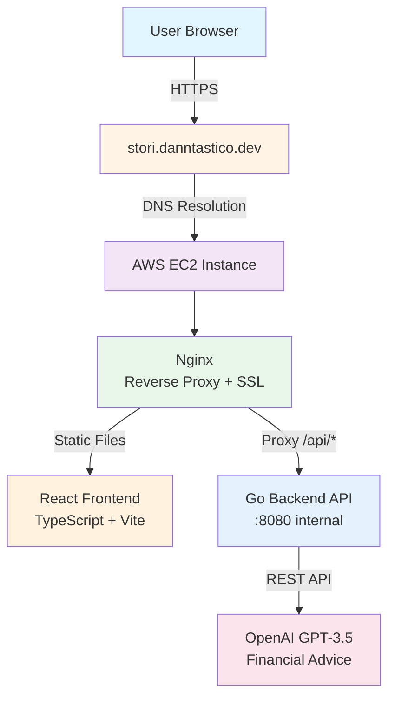

# 💰 Stori Financial Tracker

> AI-powered financial dashboard for expense tracking and personalized savings advice

**Live Demo:** https://stori.danntastico.dev/

---

## 🎯 Overview

Full-stack solution with Go Backend, React Frontend, and deployed on AWS (EC2).

**Key Features:**
- 📊 **Financial Dashboard** - Overview of income, expenses, and savings rate
- 🥧 **Category Breakdown** - Interactive pie chart of spending by category
- 📈 **Timeline Visualization** - Income vs. expenses over time
- 🤖 **AI Financial Advisor** - Personalized insights and recommendations via OpenAI GPT-3.5

---

## 🏗️ Architecture

### High-Level Design



### Tech Stack

| Layer | Technology | Reasons to choose |
|-------|-----------|-----------|
| **Frontend** | ReactTS built using Vite | Fast development, type safety with TS  |
| **Styling** | TailwindCSS | Mobile-first, rapid prototyping |
| **Charts** | Recharts | Responsive visualizations, fast implementation |
| **Backend** | Go | minimal dependencies |
| **Router** | Chi v5 | Lightweight, idiomatic Go middleware |
| **Data** | Embedded JSON | MVP simplicity (architecture supports DB swap) |
| **AI** | OpenAI GPT-3.5  |
| **Hosting** | AWS EC2 + Nginx | Balance of simplicity and production-readiness |
| **SSL** | Let's Encrypt | Free, trusted certificates with auto-renewal |

### Design Decisions

**Repository Pattern**
- Abstract data layer behind interface
- Enables future migration from JSON → PostgreSQL/DynamoDB
- No handler changes required when swapping implementations

**Clean Architecture**
- Clear separation: Domain → Repository → Service → Handler
- Business logic decoupled from HTTP concerns
- Easy to test and extend

**Deployment Strategy**
- Single EC2 instance for MVP (simple, reliable)
- Nginx handles SSL termination and static file serving
- Backend stays internal (security + flexibility)
- Custom domain for professional presentation

**Tradeoffs:**
- ✅ **Strengths:** Fast MVP, extensible design, production HTTPS, cost-effective
- ⚠️ **Weaknesses:** No horizontal scaling yet, single point of failure, manual deployments
- 🔮 **Future:** Add PostgreSQL, implement CRUD, CI/CD pipeline, containerization (ECS)

---

## 🚀 Local Development

### Prerequisites
- Go 1.22+
- Node.js 20+
- OpenAI API key (optional, fallback to mock data)

### Backend Setup

```bash
cd backend

# Copy environment template
cp env.example .env
# Edit .env and add your OPENAI_API_KEY

# Install dependencies
go mod download

# Run server
./run-local.sh
# Or: make run

# Test endpoints
curl http://localhost:8080/api/health
curl http://localhost:8080/api/summary/categories
```

### Frontend Setup

```bash
cd frontend

# Install dependencies
npm install

# Run dev server
npm run dev

# Open http://localhost:5173
```

### API Endpoints

| Method | Endpoint | Description |
|--------|----------|-------------|
| GET | `/api/health` | Health check |
| GET | `/api/transactions` | List all transactions (with filters) |
| GET | `/api/summary/categories` | Category spending breakdown |
| GET | `/api/summary/timeline` | Monthly income/expense timeline |
| POST | `/api/advice` | AI financial advice (requires OpenAI key) |

---

## 🧪 Testing Strategy

### Implemented Tests

**Backend:**
- Unit tests for domain models (`internal/domain/transaction_test.go`)
- Validation logic for financial calculations
- Date parsing and period aggregations

**Manual Testing:**
- ✅ All API endpoints functional
- ✅ Mobile responsiveness verified (iPhone, Android)
- ✅ CORS working cross-origin
- ✅ SSL certificate valid and auto-renewing
- ✅ AI integration with real OpenAI API

### Production Testing Approach

If this were production-ready, I would add:

1. **Backend Integration Tests**
   - HTTP handler tests with test server
   - Repository tests with fixture data
   - Service layer tests with mocked dependencies
   - OpenAI fallback behavior validation

2. **Frontend Tests**
   - Component tests (React Testing Library)
   - API error handling scenarios

3. **E2E Tests**
   - Cross-browser compatibility

4. **Load Testing**
   - Concurrent user simulations
   - API rate limiting validation
   - Database query optimization

**Rationale:** I was focused on generating an MVP with functional code. For prod, we would require extense code coverage in testing and a CI/CD pipelines. 

---

## 📦 Deployment

**Production URL:** https://stori.danntastico.dev/

**Infrastructure:**
- AWS EC2 (t2.micro, Amazon Linux 2023)
- Nginx (reverse proxy + SSL termination)
- Let's Encrypt SSL certificate
- Custom domain via Namecheap DNS
- Security groups: SSH (22), HTTP (80), HTTPS (443)

**Deployment Process:**
```bash
# Backend
cd backend
GOOS=linux GOARCH=amd64 go build -o stori-backend main.go
scp stori-backend ec2-user@server:/home/ec2-user/
ssh ec2-user@server 'sudo systemctl restart stori-backend'

# Frontend
cd frontend
npm run build
scp -r dist/* ec2-user@server:/var/www/stori/
```

**Environment Variables (Production):**
- `PORT=8080`
- `OPENAI_API_KEY=sk-proj-xxx`
- `CORS_ALLOWED_ORIGINS=https://stori.danntastico.dev`
- `LOG_LEVEL=info`

---

## 🔮 Future Improvements

### Features Users Would Want
1. **CRUD Operations** - Add, edit, delete transactions
2. **Multi-Account Support** - Track cash, checking, savings separately
3. **Budget Tracking** - Set monthly budgets per category with alerts
4. **Export Data** - CSV/PDF reports
5. **Custom Categories** - User-defined spending categories
6. **Goal Tracking** - Savings goals with progress visualization

### Technical Improvements
1. **Database Migration** - PostgreSQL/DynamoDB for persistence
2. **Authentication** - Multi-user support with secure login
3. **CI/CD Pipeline** - GitHub Actions for automated deployments
4. **Containerization** - Docker + ECS/EKS for scalability
5. **Monitoring** - CloudWatch/Prometheus + Grafana
6. **Caching** - Redis for frequently accessed summaries
7. **Rate Limiting** - Protect OpenAI API costs
8. **WebSockets** - Real-time dashboard updates

### Architecture Scaling
- Load balancer (ALB) for multiple EC2 instances
- Read replicas for database queries
- CDN (CloudFront) for global distribution
- Microservices split (Auth, Transactions, Analytics, AI)

---

