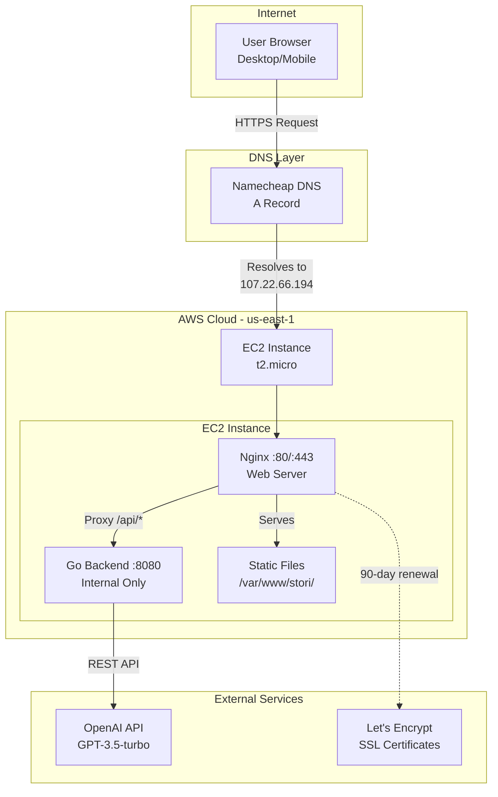

# System Design Overview

Briefly describe your system architecture. Please include an architectural diagram to helpillustrate how the main components interact.

## High Level Architecture

This application is entirely hosted in an AWS EC2 instance. A single VM (a t3.micro instance) runs the entire web server stack using Nginx for serving the static frontend assets in `/var/www/stori/`, the requests to the proxy are matching all `/api/*` to the internal Go backend listening on port `:8080`. Also a DNS resolution (A Record) to the domain `stori.danntastico.dev` was done pointing directly to the instance's public IPv4 `107.22.66.194`. 
Hosting all the FE and BE in one service wasn't my initial design (I was thinking on S3 and CloudFront for the frontend), but I got in trouble when deploying and accessing to the CloudFront CDN from many devices, because I was consuming the backend directly via the public IPv4 direction, which causes blockings from many browser due to Self Assigned SSL certification Errors. 

My main goal always was to release an MVP with the requirements attached to the Challenge, so I took the decision of serving everything in a single EC2 instance, implementing Nginx and bypassing all the Certificate restriction in order to serve HTTPS by reaching a DNS resolution with a domain of my own. 

### Strengths and weaknesses
Of course there wasn't an ideal approach, my current design offers a fully served application under a trusted HTTPS domain, SSL Certified with Let's Encrypt and Certbot for automating on renewal process. Nevertheless, I'm fully aware that this architecture design could be improved, probably by looking at other services such as:
- Frontend: S3 for serving the frontend assets statically.
- Frontend: Using a CloudFront distribution to correctly serve the S3 Bucket with the FE assets in a CDN, offering low latency, scalability and security protections against DDoS attacks.
- Backend: AWS Lambda. A serverless alternative to this Application would be another good alternative, avoid manage of OS and infraestructure resources, also having the automatic scalability.
- Backend: An elastic container service could be another alternative for performing a better horizontal scalability.
- Database: A real database service instead of using embebbed directives from Golang.

## Areas of Improvement

- Filter data by Date Range
- A real database service to persist the data. I didn't think too much on this point, but this was one of my additional goals if I was given more time.
- CRUD operations: Let users add and remove more expenses, incomes, categories, ...
- GOAL Tracking - Savings Goals with progress visualization
- Add an customize its spending categories
- Multi account supports: Tracking cash, debit cards, bank accounts, saving accounts separately.
- Export Data: CSV/PDF