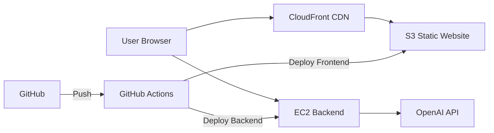
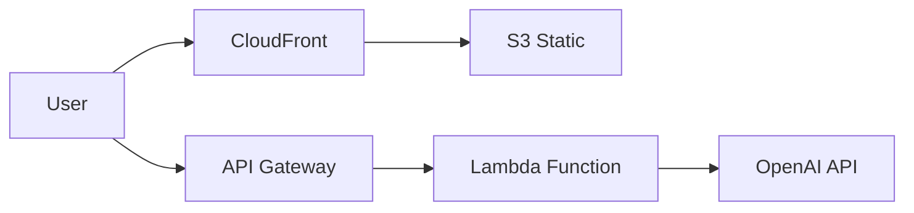

# Technical Specification - Stori Financial Tracker

## Project Overview

**Goal:** Build a mobile-friendly web application that visualizes financial data and provides AI-powered spending advice.

**Timeline:** 3-4 days  
**Scope:** MVP focused on data visualization and AI insights, architectured for future extensibility

---

## Tech Stack Decisions

### Backend
- **Language:** Go 1.22+
- **Framework:** `chi` router (minimal, idiomatic)
- **Dependencies:** 
  - `github.com/go-chi/chi/v5` - routing & middleware
  - Standard library for everything else
- **Data Source:** Embedded JSON file (`//go:embed`)
- **LLM Integration:** OpenAI API (direct HTTP calls)

**Rationale:** Earns bonus points, minimal dependencies, shows good judgment

### Frontend
- **Framework:** React 18 + Vite
- **Styling:** TailwindCSS (utility-first, mobile-first)
- **Charts:** Recharts (React-native, responsive)
- **HTTP Client:** Axios
- **State Management:** React hooks (no Redux needed for MVP)

**Rationale:** Fast development, modern tooling, strong ecosystem

### Infrastructure
- **Local Dev:** Docker Compose
- **Frontend Hosting:** AWS S3 + CloudFront
- **Backend Hosting:** AWS EC2 (simple, reliable) or ECS (if time permits)
- **CI/CD:** GitHub Actions (optional Day 4)

**Rationale:** Balance between impressive and reliable for demo

---

## API Design

### Base URL
```
Local: http://localhost:8080/api
Production: https://api.stori-challenge.com/api
```

### Endpoints

#### 1. Health Check
```
GET /api/health
```

**Response:**
```json
{
  "status": "healthy",
  "timestamp": "2024-10-24T10:00:00Z"
}
```

#### 2. Get All Transactions
```
GET /api/transactions
```

**Optional Query Parameters:**
- `startDate` (ISO 8601): Filter transactions from this date
- `endDate` (ISO 8601): Filter transactions until this date
- `type` (income|expense): Filter by transaction type
- `category` (string): Filter by category

**Response:**
```json
{
  "transactions": [
    {
      "date": "2024-01-01",
      "amount": 2800,
      "category": "salary",
      "description": "Bi-weekly salary",
      "type": "income"
    }
  ],
  "count": 114,
  "period": {
    "start": "2024-01-01",
    "end": "2024-10-28"
  }
}
```

#### 3. Get Category Summary
```
GET /api/summary/categories
```

**Response:**
```json
{
  "income": {
    "salary": {
      "total": 56000,
      "count": 20,
      "percentage": 100
    }
  },
  "expenses": {
    "rent": {
      "total": 12000,
      "count": 10,
      "percentage": 25.5
    },
    "groceries": {
      "total": 10240,
      "count": 23,
      "percentage": 21.8
    },
    "dining": {
      "total": 1850,
      "count": 18,
      "percentage": 3.9
    }
  },
  "summary": {
    "total_income": 56000,
    "total_expenses": 47000,
    "net_savings": 9000,
    "savings_rate": 16.1
  },
  "period": {
    "start": "2024-01-01",
    "end": "2024-10-28",
    "months": 10
  }
}
```

#### 4. Get Timeline Summary
```
GET /api/summary/timeline
```

**Response:**
```json
{
  "timeline": [
    {
      "period": "2024-01",
      "income": 5600,
      "expenses": 4600,
      "net": 1000
    },
    {
      "period": "2024-02",
      "income": 5600,
      "expenses": 4800,
      "net": 800
    }
  ],
  "aggregation": "monthly"
}
```

#### 5. Get AI Financial Advice
```
POST /api/advice
```

**Request Body:**
```json
{
  "context": "general",  // or "savings", "budgeting", "specific_category"
  "category": "dining"   // optional, for category-specific advice
}
```

**Response:**
```json
{
  "advice": "Based on your spending patterns over the last 10 months...",
  "insights": [
    "Your rent represents 25% of your income, which is within healthy limits",
    "Dining expenses total $1,850 (3.9% of spending)",
    "You're saving approximately 16% of your income"
  ],
  "recommendations": [
    "Consider setting a monthly dining budget of $150 to increase savings",
    "Look for grocery store deals to reduce the $1,024/month average",
    "Your savings rate is good - consider automating transfers to savings"
  ],
  "timestamp": "2024-10-24T10:00:00Z"
}
```

---

## Data Models

### Transaction
```go
type Transaction struct {
    Date        string  `json:"date"`        // ISO 8601 format
    Amount      float64 `json:"amount"`      // Negative for expenses, positive for income
    Category    string  `json:"category"`
    Description string  `json:"description"`
    Type        string  `json:"type"`        // "income" or "expense"
}
```

### Category Summary
```go
type CategoryDetail struct {
    Total      float64 `json:"total"`
    Count      int     `json:"count"`
    Percentage float64 `json:"percentage"`
}

type CategorySummary struct {
    Income   map[string]CategoryDetail `json:"income"`
    Expenses map[string]CategoryDetail `json:"expenses"`
    Summary  FinancialSummary          `json:"summary"`
    Period   Period                    `json:"period"`
}
```

### Timeline Point
```go
type TimelinePoint struct {
    Period   string  `json:"period"`   // "2024-01" for monthly
    Income   float64 `json:"income"`
    Expenses float64 `json:"expenses"`
    Net      float64 `json:"net"`
}
```

---

## Frontend Component Structure

```
src/
├── components/
│   ├── Dashboard/
│   │   ├── Dashboard.jsx           # Main container
│   │   ├── FinancialOverview.jsx   # Epic 1: Total cards
│   │   └── DateRangeBadge.jsx      # Period display
│   ├── Charts/
│   │   ├── CategoryChart.jsx       # Epic 2: Pie/Donut chart
│   │   ├── TimelineChart.jsx       # Epic 3: Line/Area chart
│   │   └── ChartContainer.jsx      # Responsive wrapper
│   ├── AI/
│   │   ├── AIAdvisor.jsx           # Epic 4: Advice component
│   │   └── InsightCard.jsx         # Individual insight display
│   └── common/
│       ├── LoadingSpinner.jsx
│       ├── ErrorBoundary.jsx
│       └── Button.jsx
├── services/
│   └── api.js                      # API client
├── hooks/
│   ├── useTransactions.js          # Data fetching hook
│   └── useAIAdvice.js              # AI advice hook
├── utils/
│   ├── formatters.js               # Currency, date formatting
│   └── calculations.js             # Client-side calculations
├── App.jsx
└── main.jsx
```

---

## Backend Architecture

```
backend/
├── cmd/
│   └── server/
│       └── main.go                 # Entry point, server setup
├── internal/
│   ├── domain/
│   │   └── transaction.go          # Core domain models
│   ├── repository/
│   │   ├── repository.go           # Interface definition
│   │   └── json_repository.go      # MVP implementation
│   ├── service/
│   │   ├── analytics_service.go    # Aggregation logic
│   │   └── ai_service.go           # OpenAI integration
│   ├── handlers/
│   │   ├── health_handler.go
│   │   ├── transaction_handler.go
│   │   ├── summary_handler.go
│   │   └── advice_handler.go
│   └── middleware/
│       ├── cors.go
│       ├── logger.go
│       └── recovery.go
├── data/
│   └── transactions.json           # Embedded data
├── go.mod
├── go.sum
├── Dockerfile
└── .env.example
```

**Key Design Patterns:**
- **Repository Pattern:** Abstracts data access, enables future DB swap
- **Service Layer:** Business logic separated from HTTP handlers
- **Dependency Injection:** Services injected into handlers
- **Clean Architecture:** Clear separation of concerns

---

## Repository Pattern (Extensibility)

```go
// Interface - what we code against
type TransactionRepository interface {
    GetAll() ([]Transaction, error)
    GetByDateRange(start, end time.Time) ([]Transaction, error)
    // Future methods for write operations
    // Create(tx Transaction) error
    // Update(id string, tx Transaction) error
    // Delete(id string) error
}

// MVP Implementation - embedded JSON
type JSONRepository struct {
    transactions []Transaction
}

func NewJSONRepository(data []byte) (*JSONRepository, error) {
    var transactions []Transaction
    if err := json.Unmarshal(data, &transactions); err != nil {
        return nil, err
    }
    return &JSONRepository{transactions: transactions}, nil
}

// Future Implementation - PostgreSQL (document only)
// type PostgresRepository struct {
//     db *sql.DB
// }
```

**This allows us to:**
- Start simple with JSON
- Document database migration path
- Show architectural maturity
- Swap implementation without changing handlers

---

## OpenAI Integration

### Prompt Strategy

```go
func buildFinancialAdvicePrompt(summary CategorySummary, context string) string {
    prompt := fmt.Sprintf(`You are a helpful financial advisor. 
    
Analyze this user's financial data and provide personalized advice:

Income:
- Total: $%.2f over %d months
- Average monthly: $%.2f

Expenses by Category:
`, summary.Summary.TotalIncome, summary.Period.Months, 
   summary.Summary.TotalIncome / float64(summary.Period.Months))

    for category, detail := range summary.Expenses {
        prompt += fmt.Sprintf("- %s: $%.2f (%.1f%%)\n", 
            category, detail.Total, detail.Percentage)
    }

    prompt += fmt.Sprintf(`
Total Expenses: $%.2f
Net Savings: $%.2f
Savings Rate: %.1f%%

Please provide:
1. 2-3 key insights about their spending patterns
2. 3-4 specific, actionable recommendations to improve savings
3. One positive reinforcement

Keep advice practical, specific, and encouraging. Use dollar amounts from the data.
`, summary.Summary.TotalExpenses, summary.Summary.NetSavings, summary.Summary.SavingsRate)

    return prompt
}
```

### API Call
```go
func (s *AIService) GetAdvice(ctx context.Context, summary CategorySummary) (string, error) {
    prompt := buildFinancialAdvicePrompt(summary, "general")
    
    reqBody := map[string]interface{}{
        "model": "gpt-3.5-turbo",
        "messages": []map[string]string{
            {"role": "system", "content": "You are a helpful financial advisor."},
            {"role": "user", "content": prompt},
        },
        "temperature": 0.7,
        "max_tokens": 500,
    }
    
    // Make HTTP POST to OpenAI API
    // Handle response, extract advice text
    // Return formatted advice
}
```

### Fallback Strategy
```go
if apiKey == "" {
    return mockAdvice(summary), nil  // Return demo advice if no API key
}
```

---

## Environment Variables

```bash
# Backend
PORT=8080
OPENAI_API_KEY=sk-...
CORS_ALLOWED_ORIGINS=http://localhost:5173,https://stori-challenge.com
LOG_LEVEL=info

# Frontend (Vite)
VITE_API_BASE_URL=http://localhost:8080/api
```

---

## Testing Strategy

### Backend Tests

**Unit Tests:**
```go
// internal/service/analytics_service_test.go
func TestCalculateCategorySummary(t *testing.T) {
    // Test aggregation logic
    // Verify percentage calculations
    // Edge cases: empty data, single transaction
}

// internal/repository/json_repository_test.go
func TestGetByDateRange(t *testing.T) {
    // Test date filtering
    // Boundary conditions
}
```

**Integration Tests:**
```go
// internal/handlers/summary_handler_test.go
func TestCategorySummaryEndpoint(t *testing.T) {
    // Spin up test server
    // Call endpoint
    // Verify response structure and values
}
```

### Frontend Tests

**Component Tests (React Testing Library):**
```javascript
// components/Charts/CategoryChart.test.jsx
describe('CategoryChart', () => {
  it('renders expense categories correctly', () => {
    // Mount component with mock data
    // Verify chart renders
    // Check labels and values
  })
})
```

**API Integration Tests:**
```javascript
// services/api.test.js
describe('API Client', () => {
  it('fetches category summary', async () => {
    // Mock fetch
    // Call API method
    // Verify request format
  })
})
```

### Manual Testing Checklist
- [ ] Mobile responsiveness (iPhone, Android)
- [ ] Charts render on different screen sizes
- [ ] AI advice generates successfully
- [ ] Error states display properly
- [ ] Loading states work
- [ ] CORS works cross-origin

---

## Deployment Architecture

### MVP (Simple, Reliable)



**Components:**
- **Frontend:** S3 bucket + CloudFront for global CDN
- **Backend:** Single EC2 instance (t3.micro)
- **DNS:** Route 53 (optional)
- **SSL:** ACM certificates

**Deployment Steps:**
1. Build React app: `npm run build`
2. Upload to S3: `aws s3 sync dist/ s3://bucket-name`
3. Invalidate CloudFront cache
4. Build Go binary: `GOOS=linux go build`
5. SCP to EC2, restart service

### Alternative (Serverless - Optional)



**Use if:** Extra time Day 3-4, want to show serverless knowledge

---

## Development Workflow

### Day 1: Backend Foundation
```bash
# Initialize Go project
go mod init github.com/yourusername/stori-backend
go get github.com/go-chi/chi/v5

# Implement in order:
1. Domain models
2. JSON repository
3. Analytics service
4. HTTP handlers
5. CORS middleware
6. Test with curl

# Dockerfile
docker build -t stori-backend .
docker run -p 8080:8080 stori-backend
```

### Day 2: Frontend + AI
```bash
# Initialize React project
npm create vite@latest stori-frontend -- --template react
cd stori-frontend
npm install recharts axios tailwindcss

# Implement in order:
1. API service layer
2. Financial overview component
3. Category chart
4. Timeline chart
5. AI advisor component
6. Responsive layout

# Docker Compose for full stack
docker-compose up
```

### Day 3: AWS Deployment
```bash
# Frontend deployment
npm run build
aws s3 mb s3://stori-challenge-frontend
aws s3 sync dist/ s3://stori-challenge-frontend
aws cloudfront create-invalidation ...

# Backend deployment
GOOS=linux GOARCH=amd64 go build -o server cmd/server/main.go
scp server ec2-user@instance:/home/ec2-user/
ssh ec2-user@instance 'sudo systemctl restart stori-backend'
```

### Day 4: Documentation & Polish
- Write architecture.md
- Create diagrams (mermaid)
- Write testing-strategy.md
- Polish README.md
- Add any bonus features if time permits

---

## Risk Mitigation

| Risk | Mitigation |
|------|------------|
| OpenAI API fails | Implement fallback mock response |
| AWS deployment issues | Have Docker Compose working locally as backup demo |
| Time runs short | MVP (Days 1-2) is complete submission |
| Go learning curve | Keep handlers simple, clear structure |
| Chart library issues | Have backup: use Chart.js instead of Recharts |

---

## Success Metrics

**Technical Excellence:**
- ✅ All API endpoints working
- ✅ Charts render correctly on mobile
- ✅ AI advice is contextual and useful
- ✅ Clean, readable code
- ✅ Proper error handling

**Architecture Quality:**
- ✅ Clear separation of concerns
- ✅ Extensible design (repository pattern)
- ✅ Well-documented tradeoffs
- ✅ Professional diagrams

**Delivery:**
- ✅ Working demo URL
- ✅ Complete documentation
- ✅ Testing strategy explained
- ✅ Future roadmap articulated

---

## Open Questions / Decisions Needed

- [ ] OpenAI API key: Will interviewer provide, or use mock?
- [ ] Domain name: Register one, or use IP/AWS domain?
- [ ] CI/CD: Worth the Day 4 time investment?
- [ ] Dark mode: Nice to have, worth the time?

---

## Next Steps

1. ✅ Review and finalize this spec
2. ✅ Set up project repositories
3. → Start Day 1 implementation (backend)
4. → Follow initial_plan_spec.md timeline

