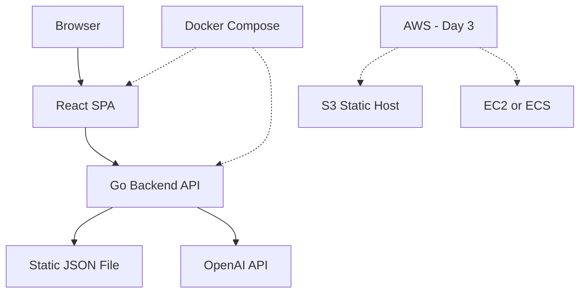

Excellent clarity! This helps tremendously. Let me analyze the Go framework question and then propose a concrete MVP architecture.

## **Go Framework Analysis**

### **Modern Go Capabilities (1.22+)**

Go's standard library gives you:
- `net/http` - Production-ready HTTP server
- `encoding/json` - Fast JSON marshaling
- `io/fs` - Embed static files
- Built-in routing (basic pattern matching)

**What you DON'T get:**
- Middleware chain management
- Flexible route parameters (`/api/transactions/:id`)
- Request validation helpers
- Structured logging helpers

### **Framework Options Evaluated**

| Approach | Pros | Cons | Verdict |
|----------|------|------|---------|
| **Pure stdlib** | Shows Go mastery, zero deps | Manual middleware, basic routing | ❌ Too spartan for this |
| **chi** (minimal router) | 1 dependency, idiomatic Go, middleware support | Need to add some utilities | ✅ **BEST CHOICE** |
| **Gin** | Fast, popular, batteries included | 15+ dependencies, feels heavy | ❌ Over-engineered |
| **Echo/Fiber** | Fast, modern | Less idiomatic Go | ❌ Unnecessary |

### **Recommendation: Go stdlib + chi router**

```go
// Only dependency needed
go get github.com/go-chi/chi/v5
```

**Why chi wins:**
- Minimal, idiomatic Go (built on stdlib)
- Middleware support (CORS, logging, recovery)
- Route parameters without complexity
- Shows good judgment: "I added ONE dependency where it adds clear value"

---

## **Proposed MVP Architecture (3-4 Day Plan)**

### **Core MVP (Days 1-2): Get it Working**



#### **Tech Stack - MVP:**

**Backend:**
- Go 1.22+ 
- chi router (routing + middleware)
- Standard library for everything else
- Data: embedded JSON file (`//go:embed`)

**Frontend:**
- React + Vite (fast dev experience)
- Recharts (React-native charting, simple)
- TailwindCSS (fast styling, mobile-first)
- Axios for API calls

**LLM:**
- OpenAI API (direct HTTP calls, no SDK needed)
- Environment variable for API key
- Fallback mock response if key missing

**Local Dev:**
- Docker Compose (backend + frontend)
- Shows DevOps thinking with minimal effort

**Deployment (Day 3):**
- S3 + CloudFront for frontend
- Single EC2 for backend (simple, reliable)
- GitHub Actions for CI/CD (optional Day 4)

---

## **File Structure**

```
stori-challenge/
├── backend/
│   ├── cmd/
│   │   └── server/
│   │       └── main.go           # Entry point
│   ├── internal/
│   │   ├── handlers/             # HTTP handlers
│   │   │   ├── transactions.go
│   │   │   ├── summary.go
│   │   │   └── advice.go
│   │   ├── models/               # Data structures
│   │   │   └── transaction.go
│   │   ├── service/              # Business logic
│   │   │   ├── aggregation.go
│   │   │   └── ai.go
│   │   └── middleware/           # CORS, logging
│   │       └── cors.go
│   ├── data/
│   │   └── transactions.json     # Embedded data
│   ├── go.mod
│   ├── go.sum
│   └── Dockerfile
│
├── frontend/
│   ├── src/
│   │   ├── components/
│   │   │   ├── CategoryChart.jsx
│   │   │   ├── TimelineChart.jsx
│   │   │   └── AIAdvice.jsx
│   │   ├── services/
│   │   │   └── api.js
│   │   ├── App.jsx
│   │   └── main.jsx
│   ├── package.json
│   ├── vite.config.js
│   └── Dockerfile
│
├── infrastructure/               # Day 3-4
│   ├── docker-compose.yml
│   └── terraform/               # Optional: IaC for AWS
│       └── main.tf
│
├── docs/
│   ├── architecture.md          # System design doc
│   ├── architecture-diagram.png
│   └── testing-strategy.md
│
└── README.md                    # High-level overview
```

---

## **API Design - Keep It Simple**

```
GET  /api/health                    # Health check
GET  /api/transactions              # All transactions (optional filters)
GET  /api/summary/categories        # Aggregated by category
GET  /api/summary/timeline          # Monthly income vs expenses
POST /api/advice                    # Request AI financial advice
```

**Example Response Structure:**

```json
// GET /api/summary/categories
{
  "income": {
    "salary": 28000
  },
  "expenses": {
    "rent": 12000,
    "groceries": 3450,
    "dining": 2100,
    ...
  },
  "total_income": 28000,
  "total_expenses": 25850,
  "net_savings": 2150,
  "period": {
    "start": "2024-01-01",
    "end": "2024-10-28"
  }
}
```

---

## **3-4 Day Execution Plan**

### **Day 1: Backend Foundation (6-8 hours)**
- ✅ Set up Go project with chi
- ✅ Load and embed JSON data
- ✅ Implement all 4 API endpoints
- ✅ Aggregation logic (category summary, timeline)
- ✅ CORS middleware
- ✅ Basic error handling
- ✅ Docker container
- **Deliverable:** Working API you can curl

### **Day 2: Frontend + AI Integration (6-8 hours)**
- ✅ React + Vite setup with Tailwind
- ✅ Category spending chart (pie/donut chart)
- ✅ Timeline chart (line/area chart)
- ✅ AI advice component
- ✅ OpenAI integration in backend
- ✅ Docker container for frontend
- ✅ Docker Compose for full stack
- **Deliverable:** Working app locally

### **Day 3: AWS Deployment (4-6 hours)**
- ✅ Frontend build → S3 + CloudFront
- ✅ Backend → EC2 (or ECS if time permits)
- ✅ Environment variables setup
- ✅ SSL/HTTPS setup
- ✅ Test end-to-end in cloud
- **Deliverable:** Live URL

### **Day 4: Polish + Documentation (4-6 hours)**
- ✅ Write architecture diagram (mermaid)
- ✅ System design writeup
- ✅ Testing strategy (write actual tests if time)
- ✅ README with setup instructions
- ✅ Optional: GitHub Actions CI/CD
- ✅ Optional: Add loading states, error handling
- ✅ Optional: Mobile responsiveness testing
- **Deliverable:** Complete submission

---

## **Impressive Details to Add (If Time Permits)**

### **Backend Polish:**
- ✨ Structured logging with `slog` (Go 1.21+)
- ✨ Graceful shutdown
- ✨ Rate limiting for AI endpoint
- ✨ Request ID tracing
- ✨ Health check with dependency status

### **Frontend Polish:**
- ✨ Dark mode toggle
- ✨ Skeleton loading states
- ✨ Export data as CSV
- ✨ Date range filtering
- ✨ Responsive mobile design
- ✨ Accessibility (ARIA labels)

### **DevOps Polish:**
- ✨ GitHub Actions pipeline
- ✨ Terraform for AWS (IaC)
- ✨ Environment-based configs
- ✨ Docker multi-stage builds (smaller images)

### **AI Polish:**
- ✨ Streaming responses (SSE)
- ✨ Different advice types (saving, budgeting, investing)
- ✨ Context-aware prompts (time-based insights)

---

## **Go Code Minimalism Example**

Here's what your `main.go` could look like with minimal dependencies:

```go
package main

import (
    _ "embed"
    "log"
    "net/http"
    "github.com/go-chi/chi/v5"
    "github.com/go-chi/chi/v5/middleware"
)

//go:embed data/transactions.json
var transactionsData []byte

func main() {
    r := chi.NewRouter()
    
    // Middleware
    r.Use(middleware.Logger)
    r.Use(middleware.Recoverer)
    r.Use(corsMiddleware)
    
    // Routes
    r.Get("/api/health", healthHandler)
    r.Get("/api/transactions", transactionsHandler)
    r.Get("/api/summary/categories", categoriesHandler)
    r.Get("/api/summary/timeline", timelineHandler)
    r.Post("/api/advice", adviceHandler)
    
    log.Println("Server starting on :8080")
    http.ListenAndServe(":8080", r)
}
```

**Total dependencies: 1 (chi)**

---

## **Key Architectural Decisions Summary**

| Decision | Choice | Rationale |
|----------|--------|-----------|
| Backend | Go + chi | Bonus points, minimal deps, shows judgment |
| Frontend | React + Vite | Fast dev, you're strongest here |
| Charts | Recharts | React-native, simple, mobile-friendly |
| Styling | Tailwind | Fast, mobile-first, modern |
| Data | Embedded JSON | Simple, interview-appropriate |
| LLM | OpenAI | Easiest API, best quality |
| Deployment | EC2 + S3 | Reliable, easy to demo |
| Testing | Actual tests | Day 4 if time, shows thoroughness |
| IaC | Terraform (optional) | Day 4, shows DevOps chops |

---

## **Risk Mitigation**

**Risks:**
1. ❌ AWS deployment fails → Have local Docker Compose working perfectly
2. ❌ OpenAI API issues → Implement mock fallback response
3. ❌ Time runs out → MVP (Days 1-2) is a complete submission
4. ❌ Go learning curve → Simple handlers, clear structure

---

## **What Makes This Great**

✅ **Shows restraint**: Go + 1 dependency  
✅ **Shows breadth**: Frontend, Backend, DevOps, AI  
✅ **Shows product sense**: Mobile-first, user-focused  
✅ **Shows architecture**: Clean separation, proper aggregation  
✅ **Shows honesty**: Will document tradeoffs clearly  
✅ **Shows delivery**: MVP first, polish second  

---

## **Your Thoughts?**

Does this architecture align with your goals? Should we:
1. ✅ Proceed with this plan?
2. 🔄 Adjust anything specific?
3. 🚀 Start implementing Day 1 backend?

What's your preference on the deployment: stick with EC2 for simplicity, or go serverless (Lambda) for extra DevOps points?